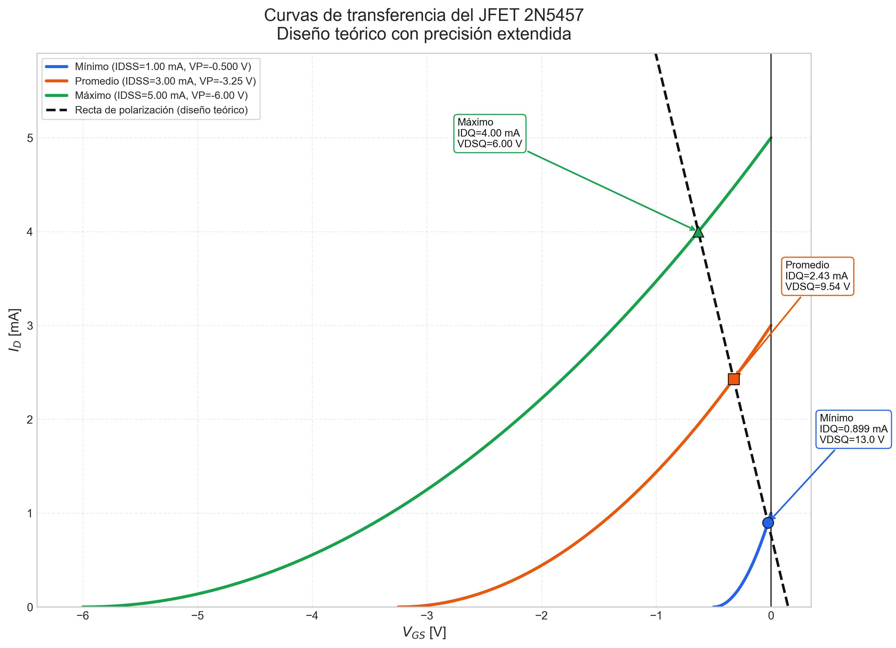
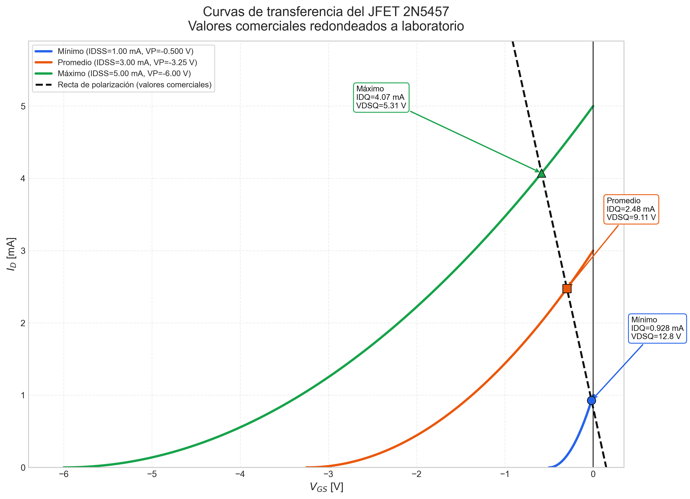

<!--
::METADATA::
type: solution
topic_id: practica-4-jfet-divisor
file_id: PRACTICA_4_CALCULOS
status: draft
audience: student
last_updated: 2026-05-20
-->

# INSTITUTO TECNOLÓGICO DE TOLUCA
## Ingeniería Electrónica
### Diodos y Transistores
#### Práctica 4 — Polarización de JFET en divisor de voltaje

---

## Plan de trabajo

El desarrollo se organiza en dos bloques, siguiendo el estilo de la práctica 3:

1. Obtener primero los valores teóricos del diseño.
2. Adaptar después esos valores a componentes comerciales y verificar cómo cambian los puntos de operación.

Como referencia estructural se toman [PRAC-03-Polarizacion-BJT-Reporte.md](../PRACTICA_3/PRAC-03-Polarizacion-BJT-Reporte.md) y [Calculos.md](../PRACTICA_3/Calculos.md), porque ahí el flujo también va de valores teóricos a valores ajustados/reales.

---

## 1. Datos de partida

### 1.1 Enunciado de la práctica

- Transistor: JFET canal N 2N5457.
- Voltaje de alimentación: $V_{DD} = 15\,\text{V}$.
- Corriente de dren deseada: $I_D = 4\,\text{mA}$.
- Voltaje de operación deseado: $V_{DS} = 6\,\text{V}$.
- Tolerancia de corriente: $\pm 0.4\,\text{mA}$.

### 1.2 Referencias de parámetros

- Referencia local útil: [Tabla_JFET.html](Tabla_JFET.html).
- Fuente externa consultada para 2N5457: hoja de datos de onsemi / Central Semiconductor.

> Nota de precisión: el script conserva los valores exactos de alta precisión como comentario; aquí se reportan valores redondeados a 3 cifras significativas.

Para el 2N5457 se toman los extremos de hoja técnica:

- $I_{DSS}$: de $1\,\text{mA}$ a $5\,\text{mA}$.
- $V_{GS(off)}$ o $V_P$: de $-0.5\,\text{V}$ a $-6\,\text{V}$.

---

## 2. Diseño teórico

### 2.1 Criterio de diseño

Como el objetivo es asegurar $I_D \approx 4\,\text{mA}$ con un JFET cuya familia presenta mucha dispersión, el diseño se ancla en el caso alto del dispositivo:

$$I_{DSS} = 5\,\text{mA}, \qquad V_P = -6\,\text{V}$$

Con esa combinación se garantiza que el dispositivo sí puede alcanzar la corriente objetivo dentro de la región de Shockley.

### 2.2 Cálculo del voltaje de compuerta-fuente

Usamos la ecuación de transferencia del JFET:

$$
I_D = I_{DSS}\left(1 - \frac{V_{GS}}{V_P}\right)^2
$$

Despejando $V_{GS}$:

$$
V_{GS} = V_P\left(1 - \sqrt{\frac{I_D}{I_{DSS}}}\right)
$$

Sustituyendo $I_D = 4\,\text{mA}$ e $I_{DSS} = 5\,\text{mA}$:

$$
V_{GS} = -6\left(1 - \sqrt{\frac{4}{5}}\right) = -0.633\,\text{V}
$$

### 2.3 Criterio práctico para la compuerta

Para mantener la compuerta cercana a tierra y conservar $I_G \approx 0$, se fija un voltaje pequeño y positivo:

$$V_G = 0.15\,\text{V}$$

Ese valor se obtiene con un divisor de alta impedancia; no es único, pero sí es práctico y fácil de implementar.

### 2.4 Cálculo de $R_S$ y $R_D$

Primero se determina el voltaje de fuente:

$$
V_S = V_G - V_{GS} = 0.150 - (-0.633) = 0.783\,\text{V}
$$

Luego, la resistencia de fuente:

$$
R_S = \frac{V_S}{I_D} = \frac{0.783}{0.004} = 196\,\Omega
$$

Por la recta de carga de CD:

$$
V_{DS} = V_{DD} - I_D(R_D + R_S)
$$

Despejando $R_D$:

$$
R_D = \frac{V_{DD} - V_{DS}}{I_D} - R_S
$$

Sustituyendo:

$$
R_D = \frac{15 - 6}{0.004} - 196 = 2.05\,\text{k}\Omega
$$

### 2.5 Cálculo de $R_1$ y $R_2$

La compuerta se fija por divisor de voltaje:

$$
V_G = V_{DD}\frac{R_2}{R_1 + R_2}
$$

Tomando un valor práctico $R_2 = 10\,\text{k}\Omega$:

$$
R_1 = R_2\left(\frac{V_{DD}}{V_G} - 1\right)
= 10\,\text{k}\Omega\left(\frac{15}{0.15} - 1\right)
= 0.990\,\text{M}\Omega
$$

### 2.6 Resumen de valores teóricos

| Magnitud | Símbolo | Valor teórico |
|---|---:|---:|
| Voltaje de compuerta | $V_G$ | $0.150\,\text{V}$ |
| Voltaje de fuente | $V_S$ | $0.783\,\text{V}$ |
| Resistencia de fuente | $R_S$ | $196\,\Omega$ |
| Resistencia de dren | $R_D$ | $2.05\,\text{k}\Omega$ |
| Resistencia superior del divisor | $R_1$ | $0.990\,\text{M}\Omega$ |
| Resistencia inferior del divisor | $R_2$ | $10.0\,\text{k}\Omega$ |
| Punto Q nominal | $Q$ | $(V_{DS}, I_D) = (6\,\text{V}, 4\,\text{mA})$ |

---

## 3. Curvas de transferencia

### 3.1 Ecuaciones a usar

Para cada caso de la familia del JFET:

$$
I_D = I_{DSS}\left(1 - \frac{V_{GS}}{V_P}\right)^2
$$

con la condición de polarización:

$$
V_{GS} = V_G - I_D R_S
$$

El voltaje de salida en cada punto de operación queda:

$$
V_{DSQ} = V_{DD} - I_{DQ}(R_D + R_S)
$$

### 3.2 Casos de la familia

Se evalúan tres conjuntos de parámetros del transistor:

- Caso mínimo: $I_{DSS} = 1\,\text{mA}$, $V_P = -0.5\,\text{V}$.
- Caso promedio: $I_{DSS} = 3\,\text{mA}$, $V_P = -3.25\,\text{V}$.
- Caso máximo: $I_{DSS} = 5\,\text{mA}$, $V_P = -6\,\text{V}$.

### 3.3 Resultados teóricos del punto Q

Usando $V_G = 0.150\,\text{V}$, $R_S = 196\,\Omega$ y $R_D = 2.05\,\text{k}\Omega$:

| Caso | $I_{DSS}$ | $V_P$ | $I_{DQ}$ | $V_{DSQ}$ |
|---|---:|---:|---:|---:|
| Mínimo | $1\,\text{mA}$ | $-0.5\,\text{V}$ | $0.899\,\text{mA}$ | $13.0\,\text{V}$ |
| Promedio | $3\,\text{mA}$ | $-3.25\,\text{V}$ | $2.43\,\text{mA}$ | $9.54\,\text{V}$ |
| Máximo | $5\,\text{mA}$ | $-6\,\text{V}$ | $4.00\,\text{mA}$ | $6.00\,\text{V}$ |

Estos valores muestran que el caso máximo sí cumple el objetivo nominal, mientras que los casos promedio y mínimo se desplazan hacia corrientes menores por la dispersión natural del JFET.

*Figura 1. Curvas de transferencia del 2N5457 para los tres casos de la tabla con la recta de polarización teórica y puntos Q calculados con precisión extendida.*

---

## 4. Adaptación a valores comerciales

### 4.1 Componentes realistas seleccionados

Para llevar el cálculo al laboratorio se seleccionan los valores estándar más cercanos de la tabla de resistencias comerciales:

| Magnitud | Valor teórico | Valor comercial estándar | Criterio |
|---|---:|---:|---|
| Resistencia superior del divisor | $0.990\,\text{M}\Omega$ | $1.00\,\text{M}\Omega$ | Coincide con el valor E12 más cercano |
| Resistencia inferior del divisor | $10.0\,\text{k}\Omega$ | $10.0\,\text{k}\Omega$ | Valor estándar exacto |
| Resistencia de fuente | $196\,\Omega$ | $180\,\Omega$ | Valor E12 más cercano en la tabla |
| Resistencia de dren | $2.05\,\text{k}\Omega$ | $2.2\,\text{k}\Omega$ | Valor E12 más cercano en la tabla |

La selección de $180\,\Omega$ y $2.2\,\text{k}\Omega$ se justifica porque son las opciones estándar más próximas a los valores teóricos; usar $2.05\,\text{k}\Omega$ no sería válido en una implementación real con resistencias discretas.

Con estos valores:

$$
V_G = 15\frac{10\,\text{k}\Omega}{1.00\,\text{M}\Omega + 10.0\,\text{k}\Omega} = 0.149\,\text{V}
$$

### 4.2 Resultados con valores comerciales

| Caso | $I_{DQ}$ real | $V_{DSQ}$ real |
|---|---:|---:|
| Mínimo | $0.928\,\text{mA}$ | $12.8\,\text{V}$ |
| Promedio | $2.48\,\text{mA}$ | $9.11\,\text{V}$ |
| Máximo | $4.07\,\text{mA}$ | $5.31\,\text{V}$ |

*Figura 2. Curvas de transferencia del 2N5457 con los valores comerciales estándar de la tabla de resistencias y el nuevo punto Q recalculado.*

El script de generación local es [PRAC-04-gen-curvas-transferencia.py](PRAC-04-gen-curvas-transferencia.py).

### 4.3 Interpretación

- El circuito comercial conserva el punto de operación dentro de la tolerancia de corriente pedida para el caso máximo.
- El caso máximo sigue cerca del objetivo nominal, aunque el uso de resistencias estándar desplaza $V_{DSQ}$ a $5.31\,\text{V}$.
- El caso promedio cae por debajo de $4\,\text{mA}$, lo que confirma la dispersión típica del 2N5457.
- El caso mínimo queda muy alejado del objetivo nominal, por lo que se toma solo como referencia de variación extrema.

---

## 5. Conclusión operativa

1. El diseño teórico se obtiene con la combinación alta de parámetros del 2N5457.
2. Los valores comerciales cercanos son fáciles de implementar y mantienen el sesgo esperado.
3. La familia de curvas muestra con claridad que el JFET es sensible a la dispersión de $I_{DSS}$ y $V_P$.

Este archivo deja lista la base numérica para la redacción del reporte y para la posterior gráfica de transferencia solicitada en la práctica.
