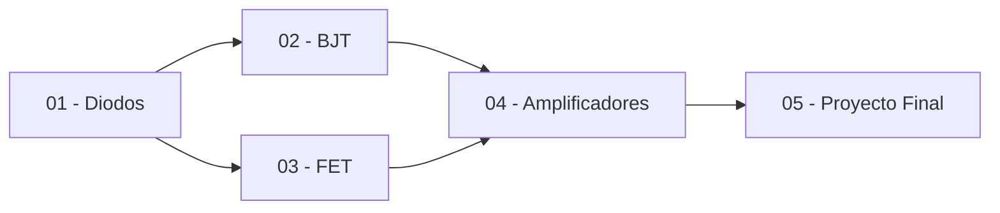

<!--
::METADATA::
type: index
topic_id: repo-readme
file_id: README
status: active
audience: both
last_updated: 2026-03-20
-->

# Diodos y Transistores

> **Repositorio de conocimiento estructurado** para la materia de Diodos y Transistores.
> Organizado como un **Jardín Digital**: modular, interconectado y procesable por IA.

---

## Navegación Rápida

| Para... | Ir a... |
|---------|---------|
| Estudiantes | [Guía de Estudio (Arquitectura)](ARQUITECTURE.md#5-metodología-de-estudio-y-trabajo) |
| Asistentes IA | [ARQUITECTURE.md](ARQUITECTURE.md#🤖-instrucciones-para-asistentes-de-ia) |
| Estándares y Mapa | [ARQUITECTURE.md](ARQUITECTURE.md) |
| Contenido completo | [Índice Wiki](WIKI_INDEX.md) |
| Definiciones | [Glosario](glossary.md) |
| Registro de Scripts | [Control Scripts](scripts/Control_Scripts.md) |

---

## 🤖 Instrucciones para Asistentes de IA (Resumen)

Para garantizar la coherencia del repositorio, toda IA debe:
1.  **Consultar [ARQUITECTURE.md](ARQUITECTURE.md)** para entender la estructura, nomenclatura y estándares técnicos.
2.  **Seguir el [AGENTS.md](AGENTS.md)** para directivas de comportamiento y flujo de trabajo.
3.  **Respetar los metadatos** en la cabecera de cada archivo Markdown.
4.  **Validar scripts** contra las directivas de Schemdraw y Matplotlib unificadas.

---

## Módulos Disponibles

| # | Prefijo | Módulo | Estado | Subtemas |
|---|---------|--------|--------|----------|
| 01 | `DIO` | [Circuitos con Diodos](topics/01-circuitos-diodos/) | review | Polarización, Rectificación, Recortadores, Sujetadores, Multiplicadores, Zener |
| 02 | `BJT` | [Transistor Bipolar](topics/02-transistor-bjt/) | draft | Características, Polarización (EC, BC, CC), Conmutación, Estabilidad |
| 03 | `FET` | [Transistor Unipolar](topics/03-transistor-fet/) | draft | Polarización fija, Auto, Divisor voltaje, MOSFET, Redes combinadas |
| 04 | `AMP` | [Amplificadores](topics/04-amplificadores/) | draft | Pequeña señal, Amplificador BJT, Amplificador JFET |
| 05 | `PRO` | [Proyecto Final](topics/05-proyecto-final/) | draft | Fuente con regulador transistorizado, Fuente con regulador CI |

---

## Mapa de Dependencias



---

## Requisitos de Software

- **Python 3.14.0** (Entorno virtual `.venv`)
- **Sistema (Linux/Codespaces):** `python3-tk`
- **Dependencias:**
  ```bash
  pip install numpy==2.4.2 matplotlib==3.10.8 schemdraw==0.22 pillow==12.1.0 packaging==26.0 python-dateutil==2.9.0.post0 six==1.17.0
  ```

### Opcionales para diagramas avanzados

- **Python (diagramas y simulacion):**
  ```bash
  pip install lcapy PySpice pygraphviz
  ```
- **Sistema (Debian/Codespaces):** `ngspice`, `graphviz`, `libgraphviz-dev`, `texlive-latex-base`, `texlive-pictures`, `dvisvgm`, `ghostscript`
- **Nota sobre LaTeX:** `pdflatex` es una dependencia del sistema (no una extension de VS Code). Las extensiones solo ayudan con edicion y previsualizacion.

---

## Ejecución de Herramientas

### Generación de Gráficas (Headless)

```bash
python scripts/DIO-gen-curva-iv.py
```

### Calculadoras Interactivas (GUI)

```bash
export DISPLAY=:1
python "topics/01-circuitos-diodos/Notas/PRACTICA 1/practica1_calculadora.py"
```

*En Codespaces, usar el puerto "Desktop" o "noVNC" para la interfaz gráfica.*

---

## Arquitectura del Repositorio

Para una descripción exhaustiva de la estructura de archivos, convenciones de nomenclatura y estándares técnicos, consulte el **[Documento de Arquitectura (ARQUITECTURE.md)](ARQUITECTURE.md)**.

```
DIODOS-Y-TRANSISTORES/
├── README.md, AGENTS.md, ARQUITECTURE.md, AUDITORIA.md
├── WIKI_INDEX.md, glossary.md, CHANGELOG.md
├── 00-meta/                  → Centro de herramientas (Plantillas)
│   └── templates/            → Plantillas para futuros repos
├── scripts/                  → Scripts Python y Control_Scripts.md
├── topics/                   → Contenido educativo (DIO, BJT, FET, AMP, PRO)
└── sandbox/                  → Zona de trabajo libre
```

---

## Instrucciones

### Para Estudiantes

1. Consulta el [Temario](ARQUITECTURE.md#4-temario-y-mapeo-de-contenidos) para ver los temas de la materia.
2. Navega al módulo de interés desde la tabla de arriba.
3. En cada módulo: los subtemas están en `theory/`.
4. Usa el [Glosario](glossary.md) para consultar definiciones.

### Para Asistentes IA

1. **Leer primero:** [AGENTS.md](AGENTS.md)
2. Consultar `manifest.json` del módulo objetivo.
3. Revisar `directives.md` del módulo.
4. Generar contenido siguiendo las reglas establecidas.

---

## 📌 Recordatorios Locales

- **Carpeta `Notas/`:** Es una zona sandbox libre de formato estricto, pero debe mantenerse organizada por temas para facilitar la búsqueda y posterior migración a `theory/`.
- **Generación de Imágenes:** Incluso en la zona de `Notas/`, se debe preferir la generación de imágenes mediante scripts de Python en lugar de inserciones manuales, para mantener la trazabilidad.
