<!--
::METADATA::
type: theory
topic_id: bjt-emisor-comun-polarizacion
file_id: Nota4
status: draft
audience: student
last_updated: 2024-05-16
-->

> 🏠 **Navegación:** [← Volver al Índice](../../../WIKI_INDEX.md) | [📚 Glosario](../../../glossary.md) | [🔙 Notas BJT](README.md)

---

## Configuraciones de Polarización para Emisor Común

En la figura siguiente se muestra un transistor NPN en configuración de Emisor Común (E-com), el cual está polarizado por la fuente $V_{CC}$. En esta configuración, los valores de $R_B$ y $R_C$ deben ser seleccionados tal que la caída de voltaje en $R_B$ sea más grande que la caída de voltaje en $R_C$ para asegurar que la unión Base-Colector (B-C) esté polarizada inversamente.

La polarización de la unión Base-Emisor (B-E) se logra a través de $R_B$ y $V_{CC}$, estableciendo la corriente de base $I_B$. La corriente de colector $I_C$ es entonces controlada por $I_B$ ($I_C = \beta I_B$). Para que el transistor opere en la región activa (necesaria para amplificación), la unión B-E debe estar polarizada en directa y la unión B-E en inversa.

### Diagrama General de Corrientes y Voltajes

A continuación se presenta un diagrama detallado que ilustra el flujo de corrientes, los potenciales en cada terminal y las relaciones matemáticas fundamentales para un transistor en configuración de Emisor Común (con estabilización de emisor).

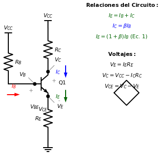

#### Resumen de Relaciones Fundamentales

Del análisis del circuito se desprenden las siguientes relaciones de corriente:
*   $I_E = I_B + I_C$ (Ley de Kirchhoff de corrientes).
*   Si consideramos que en la región activa $I_C = \beta I_B$, entonces:
    $$I_E = I_B + \beta I_B = (1 + \beta) I_B$$
    A esta relación la denominaremos **Ecuación 1**.

Basado en el diagrama anterior, las ecuaciones que rigen el comportamiento DC son:
...
*   **Corrientes:**
    *   $I_E = I_C + I_B$ (Ley de Kirchhoff de corrientes).
    *   $I_C = \beta I_B$ (Relación de ganancia en región activa).
    *   $I_E = (\beta + 1) I_B$ (Corriente de emisor en función de la base).
*   **Voltajes de Nodo:**
    *   $V_E = I_E R_E$ (Caída en la resistencia de emisor).
    *   $V_B = V_E + V_{BE}$ (Voltaje de base respecto a tierra).
    *   $V_C = V_{CC} - I_C R_C$ (Voltaje de colector respecto a tierra).
*   **Voltajes entre Terminales:**
    *   $V_{CE} = V_C - V_E$ (Diferencia de potencial colector-emisor).

### Malla de entrada (equivalente con $V_{BE}$)

Redibujando la **sección de entrada** (base–emisor) del circuito, se puede modelar la unión B-E como un diodo con caída aproximadamente constante $V_{BE}\approx 0.7\,V$ (silicio), quedando la malla:

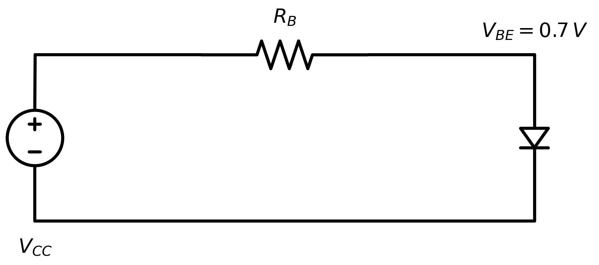

Aplicando **LVK** en la malla de entrada:

$$-V_{CC} + R_B I_B + V_{BE} = 0$$

Despejando $I_B$:

$$R_B I_B = V_{CC} - V_{BE} \;\;\Rightarrow\;\; I_B = \frac{V_{CC} - V_{BE}}{R_B} \approx \frac{V_{CC} - 0.7\,V}{R_B}$$

La condición para que la unión B-C esté polarizada inversamente es que el voltaje del colector ($V_C$) sea mayor que el voltaje de la base ($V_B$).

$$ V_C > V_B $$

Donde $V_C = V_{CC} - I_C R_C$ y $V_B = V_{CC} - I_B R_B$.

### Esquema de Polarización Fija (Emisor Común)

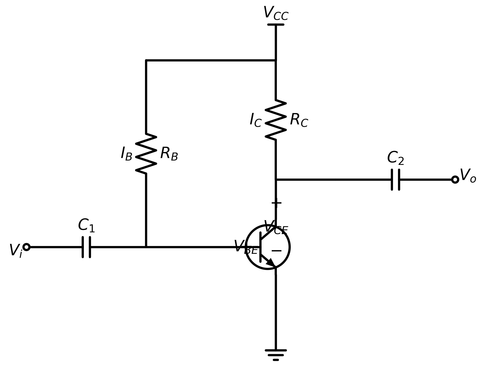

### Estabilización por Resistencia de Emisor

Al incluir una resistencia en el terminal del emisor ($R_E$), se introduce un mecanismo de **retroalimentación negativa** que estabiliza el punto de operación $Q$ frente a variaciones de temperatura o cambios en el parámetro $\beta$.

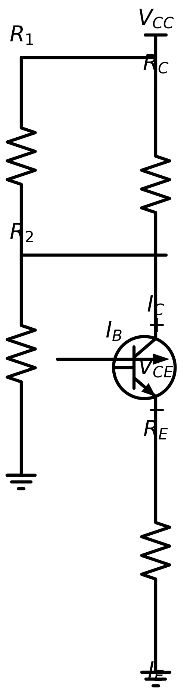

#### Mecanismo de Estabilización

La adición de $R_E$ permite que el punto de operación sea más independiente de los cambios en los parámetros internos del transistor mediante el siguiente proceso:

1.  **Relación de voltajes en la entrada:** El voltaje efectivo entre base y emisor se define por la diferencia de potencial entre dichos terminales:
    $$V_{BE} = V_B - V_E$$
    Donde $V_E$ es el voltaje de emisor con respecto a tierra:
    $$V_E = I_E R_E$$
2.  **Compensación automática:** Cualquier cambio en los parámetros que provoque un incremento en la corriente de colector ($I_C$), causará que la corriente de emisor ($I_E$) se incremente en la misma proporción ($I_E \approx I_C$).
3.  **Retroalimentación de voltaje:** Según la ecuación $V_E = I_E R_E$, el aumento de $I_E$ produce un incremento directamente proporcional en $V_E$.
4.  **Reducción de la excitación:** Si asumimos que el voltaje de base $V_B$ permanece constante, la ecuación $V_{BE} = V_B - V_E$ muestra que un incremento en $V_E$ reduce el voltaje $V_{BE}$.
5.  **Efecto estabilizador:** La reducción de $V_{BE}$ provoca una disminución en la corriente de base ($I_B$), lo que a su vez reduce $I_C$, compensando así la tendencia inicial al incremento y manteniendo el punto $Q$ estable.

---

## Recta de carga DC (malla de salida)

Aplicando la **Ley de Voltajes de Kirchhoff (LVK)** en la malla de salida (fuente–resistencia de colector–transistor):

$$-V_{CC} + R_C I_C + V_{CE} = 0$$

Reordenando:

$$V_{CE} = V_{CC} - R_C I_C$$

Esta ecuación es la **recta de carga DC**, porque describe todas las combinaciones posibles $(V_{CE}, I_C)$ impuestas por $V_{CC}$ y $R_C$.

> Si el circuito incluye una resistencia de emisor $R_E$ (polarización con emisor), la LVK de la malla de salida queda:
> $$-V_{CC} + I_C(R_C + R_E) + V_{CE} = 0 \;\;\Rightarrow\;\; V_{CE} = V_{CC} - I_C(R_C + R_E)$$
> La ecuación $-V_{CC} + R_C I_C + V_{CE} = 0$ es el caso particular con $R_E = 0$.

### Formas útiles para despejar $V_{CE}$ e $I_C$

- Si necesitas $V_{CE}$ en función de $I_C$:
	$$V_{CE}(I_C) = V_{CC} - R_C I_C$$

- Si necesitas $I_C$ en función de $V_{CE}$:
	$$I_C(V_{CE}) = \frac{V_{CC} - V_{CE}}{R_C}$$

### Intersecciones (puntos extremos)

- **Corte** ($I_C = 0$):
	$$V_{CE} = V_{CC}$$

- **Saturación ideal** ($V_{CE} = 0$):
	$$I_C = \frac{V_{CC}}{R_C}$$

En la práctica, en saturación suele cumplirse $V_{CE} \approx V_{CE(sat)}$ (típicamente 0.1–0.3 V), por lo que el extremo de corriente queda apenas por debajo de $V_{CC}/R_C$.

### Gráfico: recta de carga

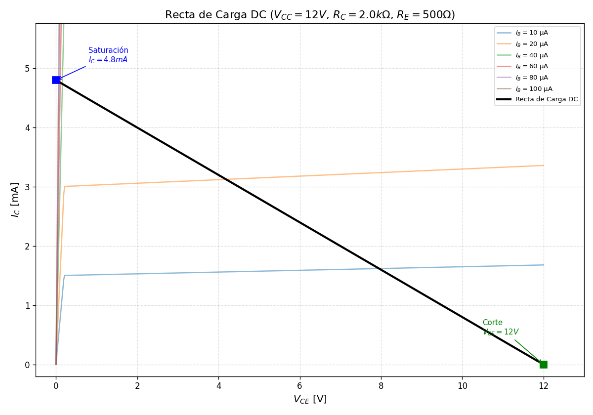

---

## Ejemplo — Punto de operación ($\beta=100$)

Un transistor **NPN de silicio** en **emisor común** (E-com) está polarizado como se muestra (emisor a tierra). Datos:

- $V_{CC}=12\,V$
- $R_B=376.67\,k\Omega$
- $R_C=2\,k\Omega$
- $\beta=100$
- Supón $V_{BE}\approx 0.7\,V$ y $V_{CE(sat)}\approx 0.2\,V$

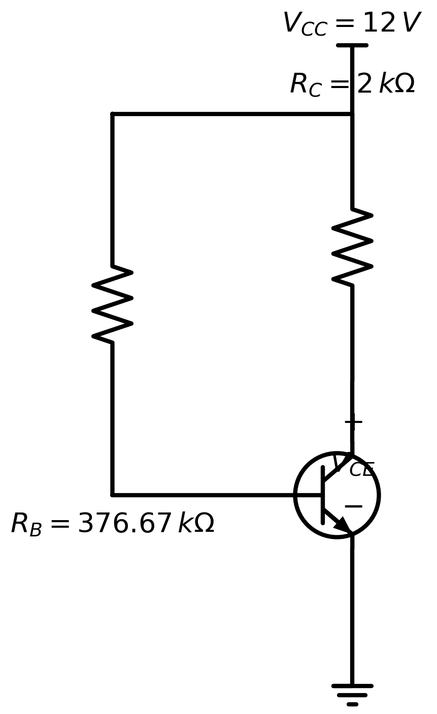

### A) Punto de operación (método gráfico)

**1) Recta de carga (malla de salida):**

Aplicando LVK:

$$-V_{CC}+R_C I_C+V_{CE}=0 \;\Rightarrow\; V_{CE}=V_{CC}-R_C I_C$$

Puntos de intersección:

- Si $I_C=0 \Rightarrow V_{CE}=V_{CC}=12\,V$
- Si $V_{CE}=0 \Rightarrow I_C=\dfrac{V_{CC}}{R_C}=\dfrac{12\,V}{2\,k\Omega}=6\,mA$

**2) Corriente de base (malla de entrada):**

Aplicando LVK:

$$-V_{CC}+R_B I_B+V_{BE}=0 \;\Rightarrow\; I_B=\frac{V_{CC}-V_{BE}}{R_B}$$

> Nota: no es correcto escribir $I_B=V_{CC}-\frac{V_{BE}}{R_B}$; el despeje correcto es $I_B=\frac{V_{CC}-V_{BE}}{R_B}$.

Sustituyendo $V_{BE}=0.7\,V$ y $R_B=376.67\,k\Omega$:

$$I_B=\frac{12-0.7}{376.67\times10^3}\approx 30\,\mu A$$

**3) Punto de operación $Q$ (intersección gráfica):**

En la gráfica de curvas de salida, se toma la curva cercana a $I_B\approx 30\,\mu A$ y se intersecta con la recta de carga.

En este caso, la intersección da aproximadamente:

$$Q=(V_{CEQ}, I_{CQ})\approx (6.0\,V,\; 3.0\,mA)$$

Como $V_{CEQ}\gg V_{CE(sat)}$, el transistor opera en **región activa**.

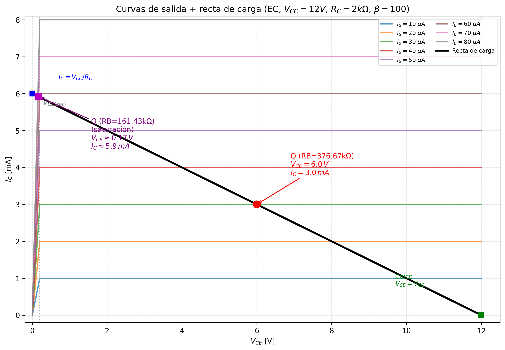

### B) Punto de operación (método analítico)

**1) Malla de entrada (LVK):**

$$-V_{CC}+R_B I_B+V_{BE}=0 \;\Rightarrow\; I_B=\frac{V_{CC}-V_{BE}}{R_B}$$

Sustituyendo:

$$I_B=\frac{12-0.7}{376.67\times10^3}\approx 30.0\,\mu A$$

**2) Corriente de colector (región activa):**

Como $\beta=\dfrac{I_C}{I_B}$, entonces (despreciando corrientes de fuga):

$$I_{CQ}=\beta I_B\approx 100\,(30\,\mu A)=3.0\,mA$$

**3) Malla de salida (recta de carga):**

$$V_{CEQ}=V_{CC}-R_C I_{CQ}=12-(2\,k\Omega)(3.0\,mA)=6.0\,V$$

Como $V_{CEQ}=6.0\,V \gg V_{CE(sat)}$, el transistor queda en **región activa** y el punto calculado es consistente.

### C) Punto de operación (gráfico) si $R_B=161.43\,k\Omega$

Primero, la nueva corriente de base:

$$I_B=\frac{12-0.7}{161.43\times10^3}\approx 70.0\,\mu A$$

Si estuviera en activa, $I_C=\beta I_B\approx 7.0\,mA$. Pero la recta de carga limita la corriente máxima a:

$$I_{C(\max)}\approx \frac{V_{CC}}{R_C}=\frac{12}{2\,k\Omega}=6.0\,mA$$

Por lo tanto, el punto Q se desplaza hacia **saturación** (cerca de $V_{CE(sat)}$). Gráficamente (intersección de la recta de carga con la región de saturación):

En la gráfica, se toma la curva cercana a $I_B\approx 70\,\mu A$ y se intersecta con la recta de carga. La intersección ocurre en la zona de saturación y da aproximadamente:

$$Q=(V_{CEQ}, I_{CQ})\approx (0.17\,V,\; 5.9\,mA)$$

Como verificación rápida (aproximación típica de saturación):

$$I_{CQ}\approx \frac{V_{CC}-V_{CE(sat)}}{R_C}=\frac{12-0.2}{2\,k\Omega}\approx 5.9\,mA$$

---

## Divisor de Voltaje

Al utilizar un transistor para amplificar una señal, el primer paso fundamental es realizar la **polarización**. El objetivo principal de este proceso es activar el dispositivo y establecer un **punto de operación $Q$** estable dentro de la **región lineal** (región activa). De esta manera, se asegura que cualquier cambio en la señal de entrada produzca un cambio proporcional en la señal de salida, evitando distorsiones.

En la figura siguiente se muestra el circuito de un transistor utilizando una configuración de **divisor de voltaje**. Esta técnica es ampliamente utilizada debido a que permite mantener prácticamente constante el voltaje de entrada en CD ($V_B$), haciendo que el punto de operación sea altamente independiente de las variaciones del parámetro $\beta$ del transistor.

#### Esquema del Circuito y Voltajes

El siguiente diagrama muestra la disposición de las resistencias $R_1, R_2, R_C$ y $R_E$, así como la alimentación única $V_{CC}$ que establece los potenciales de polarización.

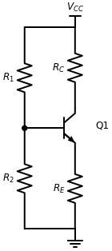
*Figura 1: Configuración de polarización por divisor de voltaje con resistencias de colector y emisor alineadas.*

#### Distribución de Corrientes

En este esquema se detallan las corrientes que circulan por el divisor ($I_1, I_2$) y los terminales del transistor ($I_B, I_C, I_E$). La estabilidad del circuito radica en que si $I_1 \gg I_B$, el voltaje en la base queda fijado casi exclusivamente por la relación entre $R_1$ y $R_2$.

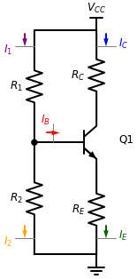
*Figura 2: Mapa de corrientes en la configuración de divisor de voltaje. Se observa la relación $I_1 = I_2 + I_B$ y $I_E = I_C + I_B$.*

---

### Análisis mediante Equivalente de Thévenin

Para realizar el análisis del comportamiento del circuito, se aplica el **Teorema de Thévenin** en la entrada del amplificador. Este procedimiento simplifica el divisor de voltaje en la base a una única fuente de voltaje $V_{TH}$ en serie con una resistencia $R_{TH}$, facilitando el cálculo de las corrientes de malla, tal y como se muestra en la figura siguiente:

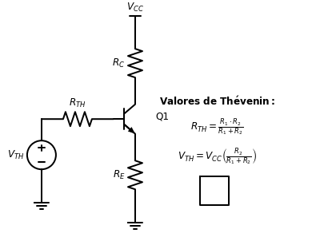
*Figura 3: Modelo simplificado de la etapa de entrada utilizando el equivalente de Thévenin.*

#### Desarrollo Matemático de Thévenin

Para transformar el divisor de voltaje en su equivalente de Thévenin, se siguen estos pasos:

**1. Cálculo de la Resistencia de Thévenin ($R_{TH}$):**
Para encontrar $R_{TH}$, se desactivan todas las fuentes independientes (en este caso $V_{CC}$, conectándola a tierra). Al observar desde el terminal de la base hacia el divisor:
*   $R_1$ queda conectada entre la base y tierra.
*   $R_2$ queda conectada entre la base y tierra.
*   Por lo tanto, ambas resistencias están en **paralelo**:

$$R_{TH} = R_1 \parallel R_2 = \frac{R_1 \cdot R_2}{R_1 + R_2} \quad \text{--- (Ec. 2)}$$

**2. Cálculo del Voltaje de Thévenin ($V_{TH}$):**
El voltaje de Thévenin es el voltaje de circuito abierto en el terminal de la base (desconectando el transistor). El circuito se convierte en un divisor de voltaje simple alimentado por $V_{CC}$:
*   La corriente que circula por el divisor (sin carga) es: $I_{div} = \frac{V_{CC}}{R_1 + R_2}$
*   El voltaje en $R_2$ (que es $V_{TH}$) se obtiene aplicando la Ley de Ohm:

$$V_{TH} = V_{CC} \cdot \frac{R_2}{R_1 + R_2} \quad \text{--- (Ec. 3)}$$

#### Cálculo de la Corriente de Base ($I_B$)

Una vez obtenido el equivalente de Thévenin, podemos analizar la **malla de entrada** del circuito simplificado (Figura 3). Aplicando la Ley de Voltajes de Kirchhoff (LVK) en dicha malla:

$$-V_{TH} + R_{TH} I_B + V_{BE} + I_E R_E = 0$$

Reordenando los términos para igualar a la fuente:

$$R_{TH} I_B + V_{BE} + I_E R_E = V_{TH}$$

Sustituyendo $I_E$ por su equivalente en función de $I_B$ mediante la **Ecuación 1** ($I_E = (1 + \beta) I_B$):

$$R_{TH} I_B + V_{BE} + (1 + \beta) I_B R_E = V_{TH}$$

Agrupando los términos que contienen $I_B$ para factorizar:

$$I_B \left[ R_{TH} + (1 + \beta) R_E \right] + V_{BE} = V_{TH}$$

Despejando finalmente la corriente de base:

$$I_B = \frac{V_{TH} - V_{BE}}{R_{TH} + (1 + \beta) R_E} \quad \text{--- (Ec. 4)}$$

Esta expresión es fundamental para el diseño, ya que permite observar cómo la resistencia de emisor $R_E$ aparece "reflejada" en la base multiplicada por el factor $(1 + \beta)$, lo que contribuye significativamente a la estabilidad del circuito frente a variaciones del transistor.

#### Análisis de la Malla de Salida ($V_{CE}$)

Para completar el análisis del punto de operación $Q$, examinamos la **malla de salida** (colector-emisor). Aplicando la LVK a la malla de salida:

$$-V_{CC} + I_C R_C + V_{CE} + I_E R_E = 0$$

Despejando el voltaje colector-emisor ($V_{CE}$):

$$V_{CE} = V_{CC} - I_C R_C - I_E R_E$$

Para expresar $V_{CE}$ exclusivamente en términos de la corriente de base $I_B$, sustituimos $I_C = \beta I_B$ e $I_E = (1 + \beta) I_B$:

$$V_{CE} = V_{CC} - I_B \left[ \beta R_C + (1 + \beta) R_E \right]$$

Finalmente, la ecuación para la **recta de carga DC** en términos de la corriente de colector (asumiendo $I_E \approx I_C$) es:

$$V_{CE} = V_{CC} - (R_C + R_E) I_C \quad \text{--- (Ec. 5)}$$

Para trazar esta recta de carga en el plano característico del transistor ($I_C$ vs $V_{CE}$), identificamos los **puntos extremos** de operación:

*   **Punto de Saturación (Máxima Corriente):** Ocurre cuando el voltaje entre colector y emisor es idealmente cero ($V_{CE} = 0$).
    $$I_C = \frac{V_{CC}}{R_C + R_E}$$
*   **Punto de Corte (Máximo Voltaje):** Ocurre cuando el transistor no conduce corriente ($I_C = 0$).
    $$V_{CE} = V_{CC}$$

A continuación se muestra la representación gráfica de esta relación lineal, donde el eje de las ordenadas (Y) corresponde a la corriente de colector $I_C$ y el eje de las abscisas (X) al voltaje colector-emisor $V_{CE}$:

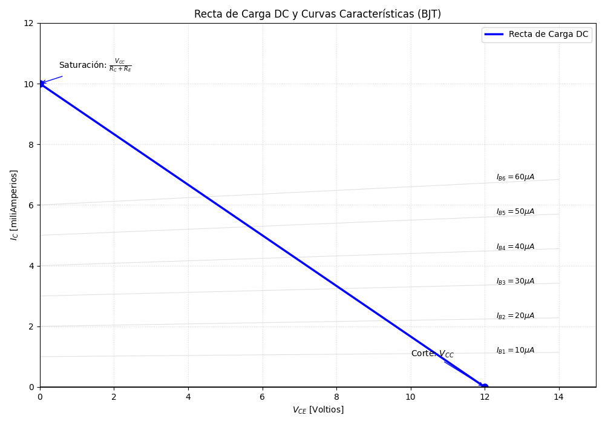
*Figura 4: Recta de carga DC mostrando los límites teóricos de operación (Corte y Saturación).*