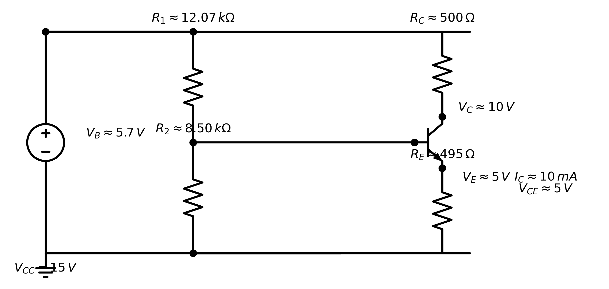
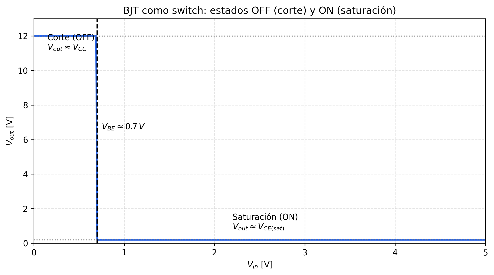

<!--
NOTA DE CLASE
Última actualización: 2026-04-29
Tema: Polarización DC de un BJT (divisor de voltaje)
-->

# Nota 5 — Ejemplo de diseño de polarización (2N2222)

## Enunciado

Calcule los valores de $R_E$, $R_C$, $R_1$ y $R_2$ de manera que se cumplan los siguientes requerimientos de diseño para un transistor **2N2222** (configuración emisor común con **divisor de voltaje en base**):

- $\beta_{min} = 100$
- $\beta_{max} = 173$
- $I_S = 3.295\times 10^{-14}\,A$ (dato proporcionado)
- Corriente de operación: $I_C = 10\,mA$
- Fuente: $V_{CC} = 15\,V$
- $V_{BE} = 0.7\,V$

> Nota sobre $I_S$: para usar el modelo exponencial $I_C \approx I_S\,e^{V_{BE}/(nV_T)}$ se requieren además $n$ (factor de idealidad) y la temperatura (para $V_T$). Como el enunciado **ya fija** $V_{BE}=0.7\,V$ y el objetivo principal es diseñar resistencias de polarización, trabajaremos con el modelo DC clásico ($V_{BE}$ constante) y usaremos $\beta_{min}$ como peor caso.

---

## 1) Topología asumida

El circuito típico de polarización por divisor de voltaje es:

- $R_C$ entre $V_{CC}$ y el colector.
- $R_E$ entre el emisor y tierra.
- $R_1$ desde $V_{CC}$ a la base.
- $R_2$ desde la base a tierra.

Esta red crea un $V_B$ casi constante y, gracias a $R_E$, se obtiene **realimentación negativa** que estabiliza $I_C$ frente a cambios de $\beta$.

---

## 2) Criterios de diseño (supuestos razonables)

Como el enunciado fija $I_C$ pero no fija el punto Q completo, podemos elegir un criterio de reparto de voltaje. En esta nota usaremos una **división en tercios** (regla práctica sencilla):

- $V_E \approx \dfrac{V_{CC}}{3}$
- $V_{CEQ} \approx \dfrac{V_{CC}}{3}$

Así queda aproximadamente:

- Caída en $R_E$: $\approx V_{CC}/3$
- Caída en el transistor ($V_{CE}$): $\approx V_{CC}/3$
- Caída en $R_C$: $\approx V_{CC}/3$

Este criterio **es válido** como punto de partida (no es el único). La presencia de $R_E$ aporta realimentación negativa y mejora la estabilidad de $I_C$ frente a variaciones de $\beta$.

---

## Primero: calcular la corriente de base $I_B$

Partimos de la relación aproximada en región activa:
$$
I_C \approx \beta\,I_B
$$

Para asegurar el diseño en el peor caso, usamos $\beta_{min}$.

$$
I_{B\,max} = \frac{I_C}{\beta_{min}} = \frac{10\,mA}{100} = 0.1\,mA
$$

---

## Paso 1: calcular $\alpha$ e $I_E$

Recordemos la definición:
$$
\alpha = \frac{I_C}{I_E} = \frac{\beta}{\beta+1}
$$

Para $\beta_{min}=100$:
$$
\alpha_{min} = \frac{100}{101} \approx 0.9901
$$

Entonces la corriente de emisor queda:
$$
I_E = \frac{I_C}{\alpha_{min}} \approx \frac{10\,mA}{0.9901} \approx 10.1\,mA
$$

Que coincide con la aproximación rápida $I_E \approx I_C\left(1+\frac{1}{\beta_{min}}\right)$.

---

## Paso 2: calcular $V_E$

Usamos el criterio de diseño elegido (división en tercios):
$$
V_E = \frac{V_{CC}}{3} = \frac{15\,V}{3} = 5\,V
$$

---

## Paso 3: calcular $R_E$ y su potencia

Con $V_E=5\,V$ e $I_E\approx 10.1\,mA$:
$$
R_E = \frac{5\,V}{10.1\,mA} \approx 495.0\,\Omega
$$

Valor práctico cercano: $R_E \approx 499\,\Omega$ (E96) o $510\,\Omega$ (E24).

### Potencia en $R_E$

$$
P_{R_E} = I_E^2\,R_E
$$

Con $I_E\approx 10.1\,mA$ y $R_E\approx 495\,\Omega$:
$$
P_{R_E} \approx (10.1\times 10^{-3})^2\,(495) \approx 50.5\,mW
$$

Recomendación práctica: usar resistencia de $1/4\,W$ (margen amplio).

---

## Paso 4: calcular $V_{CEQ}$

Por el criterio de división en tercios:
$$
V_{CEQ} = \frac{V_{CC}}{3} = \frac{15\,V}{3} = 5\,V
$$

---

## Paso 5: calcular $R_C$ y su potencia de disipación

Primero obtenemos el voltaje en el colector:
$$
V_C = V_E + V_{CEQ} = 5\,V + 5\,V = 10\,V
$$

La caída de voltaje en $R_C$ queda:
$$
V_{RC} = V_{CC} - V_C = 15\,V - 10\,V = 5\,V
$$

Entonces el valor de la resistencia del colector es:
$$
R_C = \frac{V_{RC}}{I_C} = \frac{5\,V}{10\,mA} = 500\,\Omega
$$

Valor práctico cercano: $R_C \approx 499\,\Omega$ (E96) o $510\,\Omega$ (E24).

Potencia en $R_C$:
$$
P_{R_C} = I_C^2\,R_C
$$

Con $I_C=10\,mA$ y $R_C\approx 500\,\Omega$:
$$
P_{R_C} \approx (10\times 10^{-3})^2\,(500) = 50\,mW
$$

Recomendación práctica: usar resistencia de $1/4\,W$.

---

## Paso 6: calcular $R_{TH}$ y $V_{TH}$

Este paso se usa para **dimensionar** (o verificar) qué tan “rígido” debe ser el divisor de base.

### 6.1) Voltaje de base requerido

Para polarización activa:
$$
V_B = V_E + V_{BE} = 5\,V + 0.7\,V = 5.7\,V
$$

### 6.2) Criterio de rigidez del divisor: cálculo de $R_{TH}$

Una regla práctica muy usada es imponer que el Thévenin del divisor sea pequeño frente a la resistencia vista desde el emisor amplificada por $(1+\beta)$:

$$
10\,R_{TH} = (1+\beta)\,R_E
\qquad\Rightarrow\qquad
R_{TH} = \frac{(1+\beta)\,R_E}{10}
$$

Usamos el peor caso $\beta=\beta_{min}=100$ y $R_E\approx 495.0\,\Omega$ (Paso 3):

$$
R_{TH} = \frac{(1+100)(495.0\,\Omega)}{10} \approx 4999.5\,\Omega \approx 5.0\,k\Omega
$$

> Interpretación: este valor es un **objetivo/máximo recomendado** para $R_{TH}$. Si el divisor se diseña con más corriente, $R_{TH}$ puede quedar menor (lo cual mejora la estabilidad).

### 6.3) Cálculo de $V_{TH}$

Como $V_B = V_{TH} - I_B\,R_{TH}$, entonces:
$$
V_{TH} = V_B + I_B\,R_{TH} = V_E + V_{BE} + I_B\,R_{TH}
$$

Con $I_B = I_{B\,max}=0.1\,mA$ (calculado al inicio con $\beta_{min}$):
$$
V_{TH} \approx 5 + 0.7 + (0.1\,mA)(5.0\,k\Omega)
= 5.7 + 0.5
= 6.2\,V
$$

**Verificación:** el procedimiento es correcto. Si se usa $R_{TH}=4.99\,k\Omega$ por redondeo, entonces $(0.1\,mA)(4.99\,k\Omega)=0.499\,V$ y $V_{TH}\approx 6.20\,V$ igualmente.

---

## Paso 7: calcular $R_1$ y su potencia

Conocidos $V_{TH}$ y $R_{TH}$, existe una forma directa de obtener $R_1$ y $R_2$:

$$
R_1 = \frac{V_{CC}}{V_{TH}}\,R_{TH}
$$

Sustituyendo $V_{CC}=15\,V$, $V_{TH}=6.2\,V$ y $R_{TH}=4.99\,k\Omega$:
$$
R_1 = \frac{(15)(4.99\,k\Omega)}{6.2} \approx 12.07\,k\Omega
$$

### Potencia en $R_1$

La potencia se puede calcular como:
$$
P_{R_1} = I_{R_1}^2\,R_1 = \frac{V_{R_1}^2}{R_1}
$$

Si se usa la aproximación de Thévenin (divisor sin carga), $V_{R_1}\approx V_{CC}-V_{TH}$:
$$
P_{R_1} \approx \frac{(V_{CC}-V_{TH})^2}{R_1} = \frac{(15-6.2)^2}{12.07\,k\Omega} \approx 6.41\,mW
$$

En operación real (con carga), el nodo base está en $V_B\approx 5.7\,V$, por lo que $V_{R_1}=V_{CC}-V_B=9.3\,V$ y la potencia queda ligeramente mayor ($\approx 7.2\,mW$). En ambos casos, una resistencia de $1/4\,W$ es más que suficiente.

---

## Paso 8: calcular $R_2$ y su potencia

La expresión directa para $R_2$ es:
$$
R_2 = \frac{V_{CC}}{V_{CC}-V_{TH}}\,R_{TH}
$$

Sustituyendo:
$$
R_2 = \frac{(15)(4.99\,k\Omega)}{15-6.2} \approx 8.50\,k\Omega
$$

### Potencia en $R_2$

Si se usa la aproximación de Thévenin (sin carga), $V_{R_2}\approx V_{TH}$:
$$
P_{R_2} \approx \frac{V_{TH}^2}{R_2} = \frac{(6.2)^2}{8.50\,k\Omega} \approx 4.52\,mW
$$

En operación real (con carga), $V_{R_2}=V_B\approx 5.7\,V$ y la potencia queda ligeramente menor ($\approx 3.8\,mW$).

---

## Paso 9: verificación rápida (efecto de $\beta$)

Usamos el equivalente de Thévenin visto desde la base:

$$
V_{TH} = V_{CC}\,\frac{R_2}{R_1+R_2},\qquad R_{TH}=R_1\parallel R_2
$$

Y, para el divisor con resistencia de emisor, una expresión útil es:

$$
I_E = \frac{V_{TH}-V_{BE}}{R_E + \dfrac{R_{TH}}{\beta+1}},
\qquad
I_C \approx \frac{\beta}{\beta+1}\,I_E
$$

### Con valores calculados (teóricos)

Tomando $R_1\approx 12.07\,k\Omega$ y $R_2\approx 8.50\,k\Omega$:

- $V_{TH} = 15\,\dfrac{8.50}{12.07+8.50} \approx 6.2\,V$
- $R_{TH} \approx 12.07k\Omega \parallel 8.50k\Omega \approx 4.99\,k\Omega$

Con $R_E\approx 495\,\Omega$:

- Para $\beta=100$:
	$$
	I_E \approx \frac{6.2-0.7}{495 + 4990/101} \approx 10.1\,mA
	\Rightarrow
	I_C \approx 10.0\,mA
	$$

- Para $\beta=173$:
	$$
	I_E \approx \frac{6.2-0.7}{495 + 4990/174} \approx 10.5\,mA
	\Rightarrow
	I_C \approx 10.4\,mA
	$$

Conclusión: el divisor + $R_E$ mantiene $I_C$ cercano a $10\,mA$ aun cuando $\beta$ cambie de 100 a 173.

---

## Resultado (resumen)

Valores calculados (aprox):

- $R_E \approx 495\,\Omega$ (usar $499\,\Omega$ o $510\,\Omega$)
- $R_C \approx 500\,\Omega$ (usar $499\,\Omega$ o $510\,\Omega$)
- $R_{TH} \approx 5.0\,k\Omega$ y $V_{TH} \approx 6.2\,V$
- $R_1 \approx 12.07\,k\Omega$ (usar $12\,k\Omega$)
- $R_2 \approx 8.50\,k\Omega$ (usar $8.2\,k\Omega$ o $8.6\,k\Omega$)

---

## Diagrama del circuito (con valores finales)

El siguiente diagrama ilustra la polarización por divisor (modelo de Thévenin en la base) usando los valores calculados en esta nota:

---

## Transistor BJT como switch (corte y saturación)

Existen aplicaciones donde el transistor BJT se utiliza como **interruptor** operando en dos regiones:

- **Corte (OFF):** $I_B \approx 0 \Rightarrow I_C \approx 0$. La carga queda sin corriente y, típicamente, $V_{out}$ (en el colector) queda alto.
- **Saturación (ON):** el BJT se fuerza con $I_B$ suficiente para que ambas junturas estén en directa. Entonces $V_{CE}$ cae a un valor pequeño y $V_{out}$ queda bajo.

En la práctica se usa $V_{CE(sat)}\approx 0.2\,V$ como aproximación típica (depende del transistor y la corriente).

### Circuito típico (NPN como switch de lado bajo)

### Gráfica conceptual de los 2 estados

La siguiente curva representa de forma **conceptual** los dos estados del switch usando $V_{out}$ (colector) como variable de salida:

### Curvas del transistor (ejemplo corte vs saturación)

La siguiente gráfica muestra una **familia conceptual** de curvas $I_C$–$V_{CE}$ para distintos $I_B$, junto con una recta de carga y la ubicación típica de los puntos de **corte** y **saturación**:

---

### Fórmulas de diseño (corte y saturación)

Para un switch BJT (aproximación ideal), la corriente de colector en saturación puede estimarse como:
$$
I_C(\text{SAT}) = \frac{V_{CC}}{R_C}
$$

La corriente de base mínima (usando $\beta$ como ganancia aproximada) se toma como:
$$
I_B = \frac{I_C(\text{SAT})}{\beta}
$$

Si la entrada lógica entrega $V_{HI}$ y se usa un resistor de base $R_B$ (modelo simple $V_{BE}$ constante), entonces se usa el criterio:
$$
R_B \le \frac{(V_{HI}-V_{BE})\,\beta\,R_C}{V_{CC}}
$$

De forma equivalente, despejando $R_C$:
$$
R_C \ge \frac{V_{CC}\,R_B}{\beta\,(V_{HI}-V_{BE})}
$$
