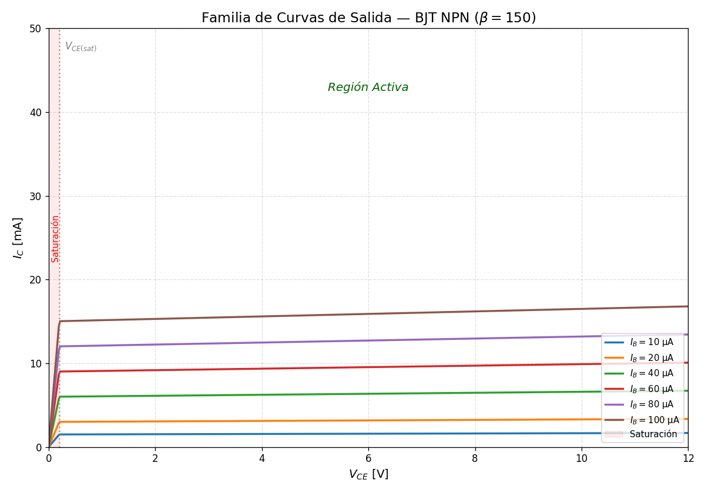

<!--
::METADATA::
type: theory
topic_id: bjt-02
file_id: BJT-02-Teoria-Polarizacion-Emisor-Comun
status: review
audience: both
last_updated: 2026-05-06
-->

> 🏠 **Navegación:** [← Módulo](../00-Index.md) | [📋 Índice Wiki](../../WIKI_INDEX.md) | [📚 Glosario](../../glossary.md)

# 2.2.1 — Polarización en Emisor Común

La configuración de **emisor común** (E-com) es la topología más utilizada en el diseño de amplificadores debido a que proporciona ganancias significativas tanto de voltaje como de corriente. En esta configuración, el emisor es la terminal común para la entrada (base) y la salida (colector).

## 1. Características de la Configuración

### Relación de Corrientes
A diferencia de la base común, aquí la corriente de colector se controla mediante la corriente de base ($I_B$). La relación fundamental es:
$$ I_C = \beta I_B + I_{CEO} $$
Donde $I_{CEO}$ es la corriente de fuga colector-emisor con base abierta. En la mayoría de las aplicaciones prácticas:
$$ I_C \approx \beta I_B $$

### Características de Entrada ($I_B$ vs $V_{BE}$)
La unión base-emisor se comporta como un diodo en directa. Un incremento en $V_{CE}$ desplaza la curva ligeramente hacia la derecha debido al **efecto Early**, que reduce las recombinaciones en la base al estrecharla.

### Características de Salida ($I_C$ vs $V_{CE}$)
Describe el comportamiento del transistor para distintos niveles de $I_B$.

## 2. Métodos de Polarización

El objetivo de la polarización es establecer un punto de operación ($Q$) estable en la región activa.

### 2.1 Polarización Fija
Es el método más simple, pero el más inestable, ya que el punto $Q$ depende directamente de las variaciones de $\beta$ (sensible a la temperatura).
*   **Malla de entrada:** $V_{CC} - I_B R_B - V_{BE} = 0 \implies I_B = \frac{V_{CC} - V_{BE}}{R_B}$
*   **Malla de salida:** $V_{CC} - I_C R_C - V_{CE} = 0 \implies V_{CE} = V_{CC} - I_C R_C$

### 2.2 Polarización Estabilizada por Emisor
Añade una resistencia $R_E$ para introducir **realimentación negativa**. Si $I_C$ intenta aumentar, $V_E$ sube, reduciendo $V_{BE}$ y, por ende, frenando el aumento de $I_C$.
*   **Malla de entrada:** $I_B = \frac{V_{CC} - V_{BE}}{R_B + (\beta + 1)R_E}$

### 2.3 Polarización por Divisor de Voltaje
Es la técnica más robusta. El voltaje de base ($V_B$) se fija mediante un divisor resistivo ($R_1, R_2$), haciendo que el punto $Q$ sea prácticamente independiente de $\beta$.

#### Análisis mediante Equivalente de Thévenin
Para simplificar el análisis, el divisor se reduce a:
*   $V_{TH} = V_{CC} \cdot \frac{R_2}{R_1 + R_2}$
*   $R_{TH} = R_1 \parallel R_2$

La corriente de base resulta:
$$ I_B = \frac{V_{TH} - V_{BE}}{R_{TH} + (\beta + 1)R_E} $$

### 2.4 Polarización por Realimentación de Colector (Pendiente)
Esta configuración utiliza una resistencia conectada entre el colector y la base para proporcionar realimentación negativa y estabilizar el punto $Q$.
*   *Contenido pendiente de desarrollo.*

## 3. Recta de Carga DC

La **recta de carga** describe todas las combinaciones posibles de $(V_{CE}, I_C)$ que el circuito puede imponer al transistor. Se obtiene aplicando LVK a la malla de salida:
$$ V_{CE} = V_{CC} - I_C(R_C + R_E) $$

*   **Punto de Corte:** $I_C = 0 \implies V_{CE} = V_{CC}$
*   **Punto de Saturación:** $V_{CE} = 0 \implies I_{C,max} = \frac{V_{CC}}{R_C + R_E}$

## 4. Ejemplo de Diseño (Divisor de Voltaje)

**Requerimientos:** $V_{CC} = 15\,\text{V}$, $I_C = 10\,\text{mA}$, $\beta = 100$.
1.  **Criterio de tercios:** Se asigna $V_{CC}/3$ a $R_C$, $V_{CC}/3$ a $V_{CE}$ y $V_{CC}/3$ a $R_E$.
    *   $V_E = 5\,\text{V} \implies R_E = \frac{5\,\text{V}}{10\,\text{mA}} = 500\,\Omega$.
    *   $V_{RC} = 5\,\text{V} \implies R_C = \frac{5\,\text{V}}{10\,\text{mA}} = 500\,\Omega$.
2.  **Base:** $V_B = V_E + V_{BE} = 5.7\,\text{V}$.
3.  **Divisor Rígido:** Se elige $R_{TH} \approx \frac{\beta R_E}{10} = 5\,\text{k}\Omega$.
4.  **Resultados:** Mediante las fórmulas de Thévenin se obtienen $R_1 \approx 12\,\text{k}\Omega$ y $R_2 \approx 8.2\,\text{k}\Omega$.

---
*Nota: Para el análisis de pequeña señal (AC), consulte el Módulo 04.*
