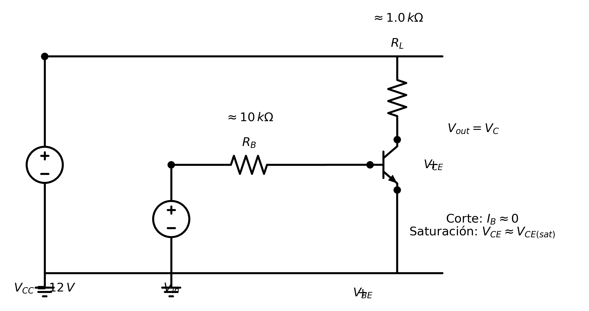
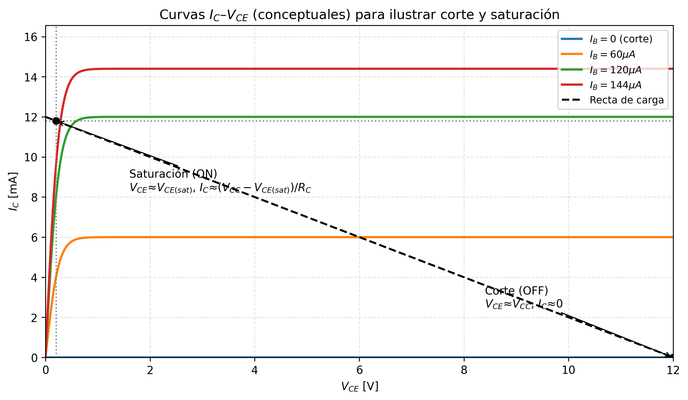

<!--
::METADATA::
type: theory
topic_id: bjt-05
file_id: BJT-05-Teoria-Conmutacion
status: review
audience: both
last_updated: 2026-05-06
-->

> 🏠 **Navegación:** [← Módulo](../00-Index.md) | [📋 Índice Wiki](../../WIKI_INDEX.md) | [📚 Glosario](../../glossary.md)

# 2.3 — Conmutación (BJT como Switch)

En aplicaciones digitales y de electrónica de potencia, el transistor BJT se utiliza frecuentemente como un **interruptor electrónico** (switch). En este modo de operación, el transistor alterna entre dos estados extremos: **Corte** (OFF) y **Saturación** (ON), evitando la región activa para minimizar la disipación de potencia en el dispositivo.

## 1. Estados del Interruptor

### Corte (Estado OFF)
*   **Condición:** $I_B \approx 0$. Ambas uniones (B-E y C-B) están polarizadas en inversa o no tienen suficiente excitación.
*   **Comportamiento:** La corriente de colector es despreciable ($I_C \approx 0$).
*   **Voltaje de salida:** $V_{CE} \approx V_{CC}$. El transistor actúa como un **circuito abierto**.

### Saturación (Estado ON)
*   **Condición:** Se inyecta una corriente de base $I_B$ lo suficientemente grande para forzar al transistor a la región de saturación. Ambas uniones están polarizadas en directa.
*   **Comportamiento:** La corriente de colector alcanza su valor máximo permitido por la carga externa ($I_{C,sat}$).
*   **Voltaje de salida:** $V_{CE}$ cae a un valor mínimo denominado $V_{CE,sat}$ (típicamente entre $0.1\,\text{V}$ y $0.3\,\text{V}$). El transistor actúa como un **interruptor cerrado**.

## 2. Análisis del Circuito (Switch de Lado Bajo)

En la configuración más común (NPN como switch de lado bajo), la carga se conecta entre $V_{CC}$ y el colector.

### Recta de Carga y Puntos de Conmutación
La operación se visualiza en la familia de curvas $I_C$ vs $V_{CE}$ intersectada por la recta de carga.

## 3. Fórmulas de Diseño

Para garantizar que el transistor entre en saturación de manera confiable, se debe cumplir que la corriente de base aplicada sea mayor que la corriente de base crítica.

### Paso 1: Determinar la corriente de colector en saturación
$$ I_{C,sat} = \frac{V_{CC} - V_{CE,sat}}{R_C} \approx \frac{V_{CC}}{R_C} $$

### Paso 2: Calcular la corriente de base mínima ($I_{B,min}$)
Utilizando la ganancia de corriente en CD ($\beta$ o $h_{FE}$):
$$ I_{B,min} = \frac{I_{C,sat}}{\beta} $$

### Paso 3: Aplicar el Factor de Sobreexcitación (Overdrive)
En diseño práctico, se aplica una corriente de base $I_B$ de 2 a 10 veces mayor que $I_{B,min}$ para asegurar la saturación ante variaciones de temperatura o reemplazo de componentes:
$$ I_{B,diseño} \approx 5 \cdot I_{B,min} $$

### Paso 4: Calcular el resistor de base ($R_B$)
Si la señal de control tiene un nivel de voltaje $V_{in}$:
$$ R_B = \frac{V_{in} - V_{BE}}{I_{B,diseño}} $$

## 4. Tiempos de Conmutación

La transición entre estados no es instantánea debido a la capacitancia de las uniones y el almacenamiento de carga en la base. Los parámetros clave son:
*   **$t_{on}$ (Tiempo de encendido):** Suma del tiempo de retardo ($t_d$) y el tiempo de subida ($t_r$).
*   **$t_{off}$ (Tiempo de apagado):** Suma del tiempo de almacenamiento ($t_s$) y el tiempo de caída ($t_f$).

> **Importante:** El tiempo de almacenamiento ($t_s$) es el factor que más limita la velocidad en los BJT, ya que los portadores en exceso deben ser removidos de la base antes de que el transistor pueda apagarse.

---
*Nota: Para ejemplos numéricos específicos, consulte las guías de problemas del módulo.*
